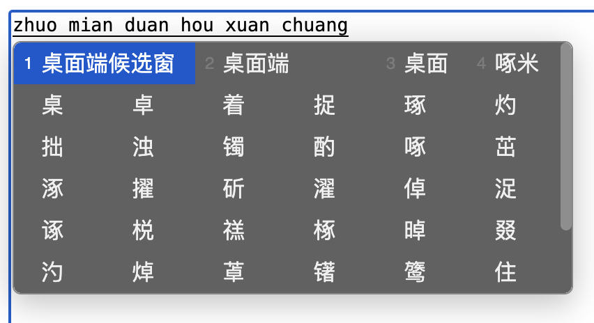
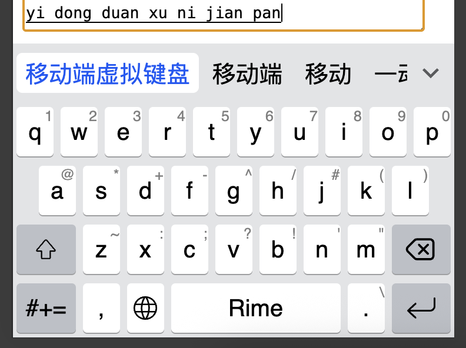

# fcitx5-rime.js
为你的网站添加 Rime 和任意方案
<table>
<tr>
<td></td>
<td></td>
</tr>
</table>

## 使用
本项目适用于方案发布者，不适用于普通用户。

您不需要自行编译本仓库的代码，只需要下载编译好的 [fcitx5-rime](https://github.com/rimeinn/fcitx5-rime.js/releases) 包。

## 准备方案
出于性能考虑，您应该提供已构建的二进制方案，而不是原始方案。

以雾凇拼音为例，在成功部署后进入用户目录，用 zip 命令将运行时所用的文件打包：

```sh
zip -r rime-ice.zip build lua opencc custom_phrase.txt
```
注意您的方案可能不含 lua、opencc 或是自定义词组，或者带有 rime.lua，或者带有模型文件或预测词库，需要您自行调整命令。

不要添加任何 yaml 文件。

将得到的 zip 文件放在网站的某个位置，记录 URL。

## 手动引用
适用于直接编辑 HTML 的原始前端项目。

将 fcitx5-rime 的 tgz 包解压，将解压后的 package/dist 中的以下文件放在网站的同一个目录下：
* Fcitx5.js
* Fcitx5.wasm
* libFcitx5Config.so
* libFcitx5Core.so
* libFcitx5Utils.so

在 `<script type="module">` 中引用 Fcitx5.js 并导入方案 zip 文件，见 [index.html](./index.html)。

当 `loadZip` 的 `Promise` 完成时，您的方案即可在网页的 `input` 和 `textarea` 正常工作（前提是系统的输入法处于英文状态）。

## npm 引用
适用于 npm 管理的现代前端项目。

将 fcitx5-rime 的 tgz 包放在项目的某个位置，使用 `pnpm install /path/to/tgz` 直接从本地安装。

安装完成后您的 package.json 应有如下一行
```
"fcitx5-rime": "file:*fcitx5-rime-*.tgz"
```

如果您配置了 CI，可以考虑将 tgz 排除在 git 外，并在 CI 中加入下载 tgz 的命令。

为了使 wasm 在测试和部署时都能正确加载，您需要做一些额外配置。
以 vite 为例，在 [vite.config.ts](./demo/vite.config.ts) 中加入
```js
optimizeDeps: {
  exclude: ['fcitx5-rime'],
},
```
后，`pnpm run dev` 可以正常加载 wasm。配合 [vite-plugin-static-copy](https://github.com/sapphi-red/vite-plugin-static-copy) 可以使 `pnpm run build` 正常打包 wasm。

引用方式同前，见 [App.vue](./demo/src/App.vue)
